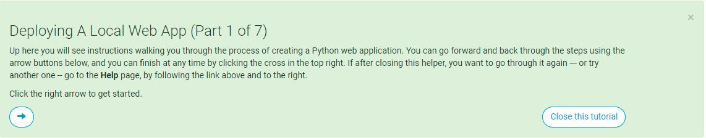
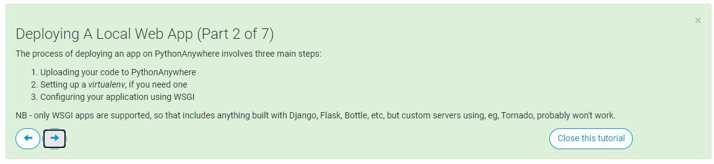
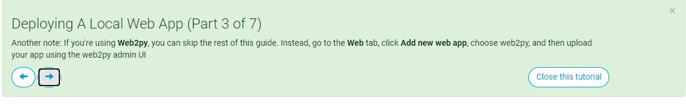
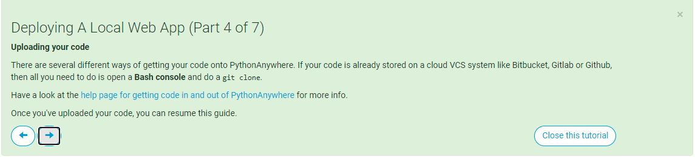
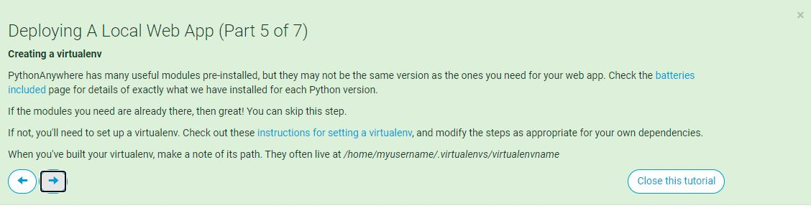
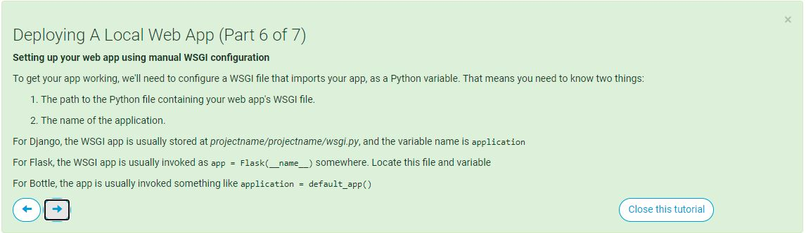
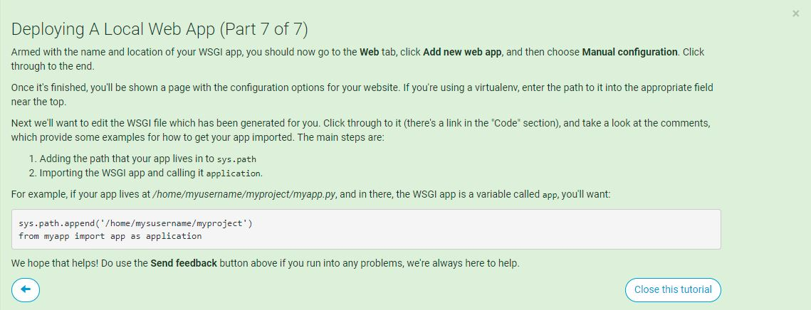
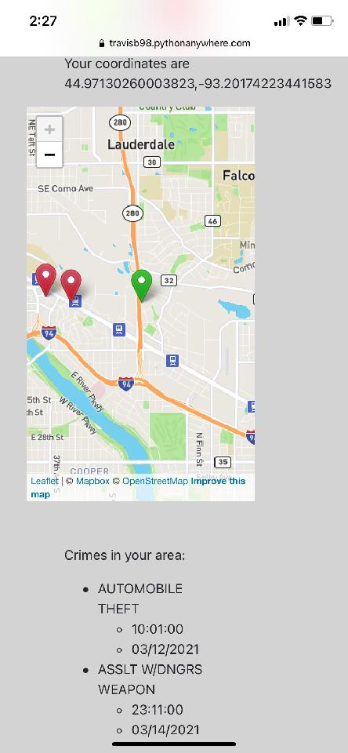

# Minneapolis Crime Watcher

---

# **To do List !**
- make html and css pretty(connor)
- decide on means of generating crime data. should the section headers be present before the data is processed, or should the section headers populate with the data being passed from the server???(connor/travis) - filler text?
- Link to readme on page
- reorganize files in github and delete the data we don't need since the api is implemented
- finish gauge (Joe M) and implement into flask app
- finish readme (Joe Kell)
- Present with python anywhere and ask for a class mate in minneapolis to share their screen and demonstrate our app
- make sure to upload a finalized version of the app to pythonAnywhere. Or better yet, connect pythonAnywhere account to github repository(Travis)

# Post presentation ideas
- goldeneye transition
- add descriptive locations to the list of crimes with geopy or geocoder(ie nicollet and third street)
- Places : your coordinates, stadium, downtown, campus, etc
- most common crime near you is x
- plot ALLL crimes, not just nearby crimes
- color code the markers
- geofencing minneapolis borders, just use min and max coordinates of minneapolis
- change the name of the repository to Minneapolis_Crime_Watcher ?
- figure out if we can move api calls to the backend to protect our keys
- numeric identfier for markers

## Overview
For this project, we'll use data on police incidents in minneapolis to build a machine learning model that determines a safety score based on a user's location and other demographics. The application will display the users location on a map with other crime related data. 

# Programs, Languages and tools
- Python
- Scikit-Learn
- Javasacript
- HTML
- CSS
- Leaflet
- mapbox
- Python Anywhere
- pandas
- requests
- datetime
- flask
- flask_cors
- geocoder
- ipyleaflet
- geopy
- numpy
- json
- pickle
- math

# Data Sources
- https://opendata.minneapolismn.gov/datasets/police-incidents-2021/data?orderBy=neighborhood&orderByAsc=false
- https://www.revisor.mn.gov/court_rules/rule/sg-5/

#  Steps/game plan
- Extract:
    - created python file update_2021.py that downloads and updates the 2021 csv
- Transform:
    - blah blah
- Load:
    - blah blah blah
- clean data
- train model
- use sentencing guidelines to create dictionary for severity of offenses https://www.revisor.mn.gov/court_rules/rule/sg-5/
- 2 options
    - cluster then model danger
    - grid then model danger
- ETL 
    - look into API or CSV options, make it download
    - ETL should download data for current and prior year, clean then combine data
    - delete uneeded csv
    - "enter number of days you want to use to predict"
- Front End
    - map that shows current location and recent crimes in vicinity
    - guage that shows danger level for your location
    - possible danger shading around border of map

# joes step list

1. Download all data using API or csv's
2. Clean and filter data and delete csv's if they exist storing data in ram 
3. run clustering model to determine which cluster each point is in or optionally train a new clustering model
4. Run Aggregation algorithm creating new data set and deleting old
5. train model using up to date data
6. predict current time period and return value

# Information flow
- send user coordinates from browser to server
- the server hit's the opendata api, get's recent crimes in the users area, and calculates a danger score
- The server returns the danger score and nearby crimes
- Plot user's location
- Plot nearby crimes
- Display nearby crimes in a list

# notes on python anywhere

https://www.pythonanywhere.com/

- Python anywhere is a easy and free to use site that allows you to deploy python website super easily
- The free version allows 1 site at a time with a non-custom url  
- PythonAnywhere has a bunch of modules installed, which is great. However, if we're using modules that aren't included in their prepackaged environment, we'll need to create a virtual environment
- If the machine learning code will run recurrently on the server, we should review the PythonAdv environment we set up for machine learning
- Which modules are already included in PythonAnywhere : https://www.pythonanywhere.com/batteries_included/
- Notes on setting up a virtual environment : https://help.pythonanywhere.com/pages/Virtualenvs
- Since many of the modules we used were not included with PythonAnywhere's prepackaged environment. We had to make a virtual environment, which was actually very easy.
- PythonAnywhere's Guide to deploying a web app:
 
 
 
 
 
 
 

# Location Test

# notes from class brain storming
https://opendata.minneapolismn.gov/

https://opendata.minneapolismn.gov/datasets/police-incidents-2021/data?orderBy=neighborhood&orderByAsc=false

similar project:

https://towardsdatascience.com/demand-forecast-boston-crime-data-64a0cff54820

How safe are you in minneapolis based on location

machine learn to classify how safe we are

geofencing, extra feature

safety score

2 models, one for if you want to include your race or not

numerical

everything is quantified, murder is 10, rape is 9, etc

have a feature that does retraining

would we want to make a web based version or a browser based

how are we going to host it? https://www.pythonanywhere.com/

use rate limiter for number

have users enter their own API key

star out api key when user enters it into text field

use this for making the map https://plotly.com/javascript/scattermapbox/

how would the events of 2020 affect our dataset?

where are we starting and ending our data time wise ?

should we use tableau to do a preliminary analysis on the data?

how many clusters is to many clusters?

safety is y, time is x

safety score = if a crime happens to you now, how bad will it be

# Minneapolis Crime Watcher Application

## Overview

Have you ever been in Minneapolis and asked yourself "How safe am I here?"? This application uses machine learning to answer just that. Access the application [here](https://travisb98.pythonanywhere.com/)

By using an algorithm to convert recently reported crimes in Minneapolis to danger scores for each of the 500 sections (created with clustering), a linear regression model calculates the current danger level of the user's location. 

## Data Source
- [DG Course Review](https://www.dgcoursereview.com/) is a site that lists thousands of disc golf courses around the world. For this project, we'll be focusing on courses in the United States. Each course page lists many details including:
    - Course Name
    - Private or Public Status
    - Pay to Play Course
    - State
    - Holes
    - Presence of Water on a Course
    - Presence of Water at each Hole
    - Terrain (Lightly Wooded, Moderately Wooded, Heavily Wooded)
    - Landscape (Mostly Flat, Moderately Hilly, Very Hilly)
    - Rating
    - Reviews
    - Course Length
    

## Project Steps
1. Scrape each course page DG Course Review
2. Set-up MongoDB Atlas database
3. Create functions to aggregate data
4. Display aggregate data in the browser dashboard

## Tools and Languages
- MongoDB
    - MongoDB Atlas
    

- Python
    - Flask
    - Javascript
    - Beautiful Soup
    - Splinter
    - Pandas
    - Datetime
    - Time
- HTML
- CSS
  - Bootstrap
- JavaScript
  - D3
  - Plotly

- ## File Overview
  - ### index.html
    ##### *html framework for page*
  - ### DiscScape.ipynb
    ##### *jupyter notebook used for scraping [DG Course Review](https://www.dgcoursereview.com/)*
  - ### app.py
    ##### *application for running flask server and api*
  - ### main.js
    ##### *handles the filters and parameters selected on the sidebar, then calls the js files for the 3 plots*

- ## How to Use the Dashboard
    1. Select the Primary Feature using the sidebar, this will determine the y-values of the scatter plot, bar chart and the choropleth maps.
    2. Select the Secondary Feature using the sidebar, this will determine the x-values of the scatter plot.
    3. Use the Checkboxes in the sidebar to filter out types of courses that you aren't interested in. By default all boxes are checked, meaning that no courses are filtered out. If you are a beginner and don't want to lose discs, you may want to uncheck "Show Courses With Water".
    4. Click "Update Dashboard".
    5. Explore the visuals.
    6. Repeat!

- ## Conclusion
    - Overall, this project is a great showcase of multiple tools and languages including Python, Javascript, CSS, and HTML. Python was used to create the server, access the database, and provide the api endpoints. HTML and CSS were used to create the general page structure and styling.Javascript was used to create the graphs and manage feature selection and filtering. The dashboard offers users the ability to search multiple course features and apply multiple filters.
    
 

