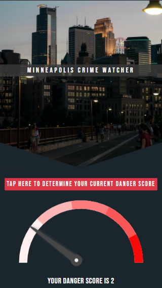

# Minneapolis Crime Watcher Application

## Overview

This application uses machine learning to answer the question "How safe am I at this location in Minneapolis?". Access the application [here](https://travisb98.pythonanywhere.com/)

By using an algorithm to convert recently reported crimes in Minneapolis to danger scores for each of the 500 sections (created with clustering), a linear regression model calculates the current danger level of the user's location. The application also displays the user's location on a map along with recently reported crimes in that area. 

## Data Sources

Crime data comes from [Open Data Minneapolis](https://opendata.minneapolismn.gov/datasets/police-incidents-2021/data?orderBy=neighborhood&orderByAsc=false) where all past police incidents are hosted. Incidents from the previous day are added at 9:30 am central time each day.

Crime severities come from [the Minnesota Courts](https://www.revisor.mn.gov/court_rules/rule/sg-5/).

## Tools and Languages

- Python (hosted on Python Anywhere)
    - Flask
    - Scikit-Learn
    - Pandas
    - Requests
    - Pickle
- HTML
- CSS
  - Bootstrap
- JavaScript
  - D3
  - Jquery
  - Leaflet/Mapbox
  - Ajax

## Application Elements

### API Connection
We used the API from [OpenDataMinneapolis](https://opendata.minneapolismn.gov/datasets/police-incidents-2021) .
Since each year had its own api string, we developed the code to make multiple API hits, once for each year of requested data. We also used queries within the url to request data within the last x number of days, which allowed us to toggle the amount of data coming back from the API. We then used geopy to get a descriptive location of the crime by inputting the crime's coordinates. All of this functionality was built into functions within the crime_api.py file. The functions were then implemented into the flask server in the app.py file.

### Machine Learning
1. Use API to collect current and past year's crime data
2. Use these reported crimes' locations to train a clustering model
3. Run Aggregation algorithm to develop the danger score of each cluster for each day that will be considered in the predictive model
4. Train linear model using the danger level of the previous 14 days
5. Predict the danger level of each cluster for the current day

### Flask App
The Flask app is contained in the app.py file. The flask server contains 2 main routes. The home page that is loaded when the user initially visits the website and the load route which receives and returns data to and from the front-end javascript.

### Map
We used javascript leafly to map the user's location and locations of crimes in the user's area. To distinguish the user's maker from the crime markers, we made the user's marker green and the crime markers red. The crime markers have pop-ups that contain details related to the crime including date, time, and type of offense.

### Gauge
The gauge and needle are based off of Preethi Ranjit's tutorial on [Creating an SVG Gauge Meter Animation](https://www.hongkiat.com/blog/svg-meter-gauge-tutorial/). We modified the code from the tutorial to add our own scale, colors, and size. When a danger score is returned from the server, it will be both reflected on the gauge and displayed underneath it.

### Data Flow
1. Send user coordinates from browser to server
2. The server hits the Open Data Minneapolis API, gets recent crimes in the users area, and calculates a danger score
3. The server returns the danger score and nearby crimes to the client
4. The gauge is updated with the calculated danger score
5. The nearby crimes and the user's location get plotted on the map
6. Nearby crimes are also displayed in a table

## Conclusion

Overall, this project is a great showcase of multiple tools and languages including machine learning, Python, Javascript, CSS, and HTML. Machine learning is used to predict the danger score for the user's location. Python was used to create the server, access the database, and provide the api endpoints. HTML and CSS were used to create the general page structure and styling. Javascript was used to create the visuals on the page.
    
 
